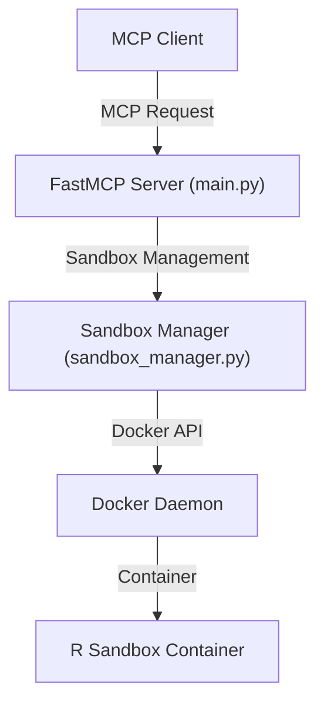

# Architecture Overview - OMCP R Sandbox

This document describes the high-level architecture and design principles of the OMCP R Sandbox.

## System Overview

The OMCP R Sandbox provides a secure, containerized environment for executing R code via the Model Context Protocol (MCP). It is designed for safe, isolated, and resource-limited code execution, suitable for AI agents and automated workflows.

## Key Components

- **FastMCP Server** (`src/omcp_r/main.py`): Implements the MCP server and exposes tools for sandbox management and R code execution.
- **Sandbox Manager** (`src/omcp_r/sandbox_manager.py`): Handles Docker container lifecycle, including creation, execution, and cleanup of R sandboxes.
- **Configuration System** (`src/omcp_r/config.py`): Loads environment-based configuration for timeouts, resource limits, and Docker image selection.

## Component Interactions

## Sandbox Lifecycle

1. **Create Sandbox**: FastMCP tool requests SandboxManager to create a new R sandbox (Docker container).
2. **Execute R Code**: FastMCP tool sends R code to SandboxManager, which executes it in the specified container using `Rscript -e`.
3. **List Sandboxes**: FastMCP tool queries SandboxManager for active sandboxes and their metadata.
4. **Remove Sandbox**: FastMCP tool instructs SandboxManager to stop and remove a sandbox container.

## Security and Isolation

- **Network Isolation**: Containers run with no network access (`network_mode="none"`).
- **Resource Limits**: Memory and CPU limits are enforced per container.
- **User Isolation**: Containers run as a non-root user (UID 1000).
- **Filesystem Security**: Read-only root filesystem with limited writable tmpfs mounts.
- **Capability Dropping**: All Linux capabilities are dropped.
- **No Privilege Escalation**: Containers are started with `no-new-privileges` security option.

## Extensibility

The architecture is modular, allowing for future extension (e.g., additional R tools, package installation, or integration with other MCP agents).

---

For more details, see the [Implementation Details](implementation.md) and [Security Model](security.md). 